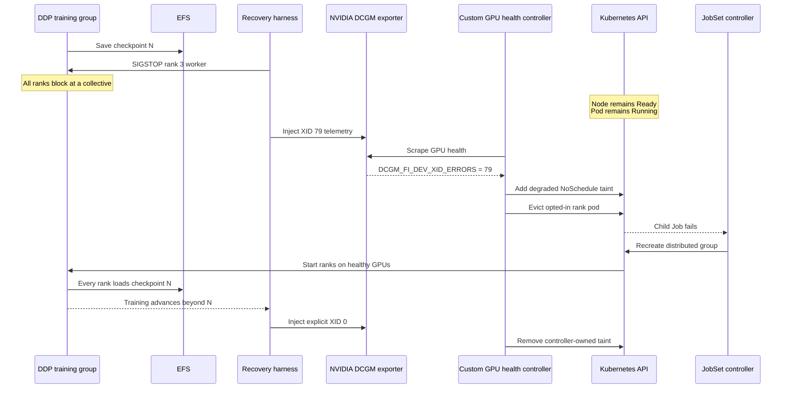

# Building a Kubernetes GPU Health Controller: From XID Detection to Checkpoint Recovery

## When the Node Is Healthy but the GPU Is Not

I kept hearing that GPU clusters are difficult to operate because GPUs can fail without changing Kubernetes' standard node-health signals. The instance, kubelet, and pod may all remain alive even though the GPU itself is no longer usable.

That failure mode becomes more expensive during distributed training. One failed GPU can stall the entire process group, and restarting the job without a durable, consistent checkpoint can discard progress produced at significant cost across many machines.

I wanted to understand how an infrastructure engineer could mitigate both problems:

- Detect a GPU-specific failure even when the Kubernetes node remains healthy.
- Stop new workloads from using the affected node.
- Move the interrupted training workload onto healthy hardware.
- Restore training from a shared checkpoint.
- Verify that training continues without silently losing committed progress.

## Why one stopped rank stalls the job

PyTorch DistributedDataParallel gives every rank a complete model replica and divides the input data between them. Each rank computes locally, but the optimizer step depends on collective gradient synchronization. In the two-rank local fixture, the work looks like this:

```
DDP step 3:
  rank 0: 16 examples ─┐
                       ├ simultaneously → approximately ε + communication
  rank 1: 16 examples ─┘

DDP step 4:
  rank 0: 16 examples ─┐
                       ├ simultaneously → approximately ε + communication
  rank 1: 16 examples ─┘

Total: 64 examples in approximately 2ε + communication overhead
```

The four-rank AWS workload follows the same synchronization rule. If one rank stops participating, the others eventually block at a collective even if their pods, nodes, and Python processes still appear alive.

## From telemetry to remediation

To make those mechanics visible, I wrote a small Kubernetes controller that classifies XID telemetry exposed by DCGM exporter and translates it into node isolation and targeted pod eviction. I then built a distributed PyTorch workload that checkpoints enough state to recover correctly after Kubernetes recreates its rank group.

The other question was how to develop this without using an AWS GPU cluster for every iteration. I started with unit tests, fake GPU nodes, and simulated DCGM metrics in a local kind cluster, then deployed the same controller logic to EKS and exercised it against physical NVIDIA L4 GPUs.



## The final experiment

The final experiment connected the two sides. I ran four SmolLM training ranks on four `g6.xlarge` instances, each containing one NVIDIA L4 GPU, while two additional instances provided replacement capacity.

To model the effect of an accelerator failure, the harness sent `SIGSTOP` to rank 3's Python worker. That rank stopped participating in DDP collectives, so the entire training group stopped making progress, but Kubernetes continued to report its pod as `Running` and the node as healthy.

The harness then injected synthetic XID 79 telemetry into DCGM on the same node. The controller observed that telemetry through DCGM exporter, tainted the node, and evicted the affected worker. JobSet recreated the distributed group on healthy GPUs, all four ranks restored the same EFS checkpoint, and training continued beyond the step where it had stalled.

A successful confirmation run produced this concise harness output:

```console
$ make test-aws-training-recovery
20:44:38 +000.0s [harness]               Started SmolLM recovery test with 4 ranks
20:44:40 +002.5s [kubernetes]            Submitted TrainJob aws-train-20260825034438
20:45:06 +027.6s [kubernetes]            Placed rank 0→gpu-a, rank 1→gpu-b, rank 2→gpu-c, rank 3→gpu-d
20:46:08 +090.3s [workload]              All 4 ranks are training SmolLM3-3B with CUDA/NCCL
20:46:51 +133.4s [workload]              Rank 0 reached step 11; checkpoint 10 is durable on EFS
20:47:01 +142.7s [harness]               Paused rank 3 worker in pod 4616c50f on gpu-d
20:47:45 +187.3s [kubernetes]            Pod 4616c50f still reports Running; Kubernetes has not replaced it
20:47:45 +187.3s [workload]              Training is stalled at step 15; checkpoint 15 is the recovery fence
20:47:48 +190.1s [harness]               Injected synthetic XID 79 telemetry for GPU 0 on gpu-d using DCGM
20:47:49 +191.2s [gpu-health-controller] Isolated gpu-d after detecting critical XID 79
20:47:53 +195.5s [kubernetes]            Evicted rank 3 pod 4616c50f from gpu-d
20:48:01 +202.7s [kubernetes]            Replaced rank 3 on gpu-e with pod a5fef005
20:49:26 +288.3s [workload]              All 4 ranks resumed from EFS checkpoint 15
20:49:30 +291.6s [workload]              Training advanced to step 18 after recovery
20:49:32 +294.3s [harness]               Cleared the injected XID on gpu-d
20:49:52 +314.1s [gpu-health-controller] Returned gpu-d to service
20:49:58 +320.3s [harness]               PASS — detection 1.1s, replacement 11.5s, workload recovery 100.4s
```

This is deliberately a composite experiment, not a manufactured physical GPU failure. `SIGSTOP` creates the application-visible stall, while DCGM field injection creates the health observation that drives remediation. The [full experiment record](experiments/smollm_stalled_rank_xid_recovery_2026-08-24.md) describes the limits of that evidence.

## Controller design decisions

### Telemetry does not produce a Kubernetes event

The controller reconciles Kubernetes `Node` objects, but a value changing on a DCGM exporter's Prometheus endpoint does not update a `Node`. Watching Kubernetes objects alone would therefore miss the failure. The reconciler periodically requeues every node, finds the ready exporter assigned to that node, and scrapes it directly. Annotation changes still trigger immediate local-test reconciles, while polling bounds detection time for real metrics.

### The controller must own what it removes

Taints are shared Kubernetes state. Another operator or administrator may already have isolated a node, so the controller cannot safely remove every matching or related taint when its own signal clears. When this controller adds its exact `NoSchedule` taint, it records ownership with an annotation. Recovery removes only that owned taint and preserves pre-existing or unrelated taints. Repeated reconciles remain idempotent and do not duplicate either the taint or its transition event.

### Isolation must precede narrowly scoped eviction

Evicting first creates a race in which JobSet can place the replacement rank back on the unhealthy node. The controller therefore taints the node before requesting any eviction. It also avoids becoming a general-purpose pod killer: only active Kubeflow training pods on that node with the explicit `gpu-orch.dev/auto-remediate=true` label are eligible. It uses Kubernetes' Eviction API, treats an already-gone pod as success, continues attempting other pods after one failure, and retries through normal reconciliation.

Those choices are the core of the project. The infrastructure makes the failure reproducible, but the controller is what turns a GPU-specific observation into a bounded, reversible Kubernetes action.
